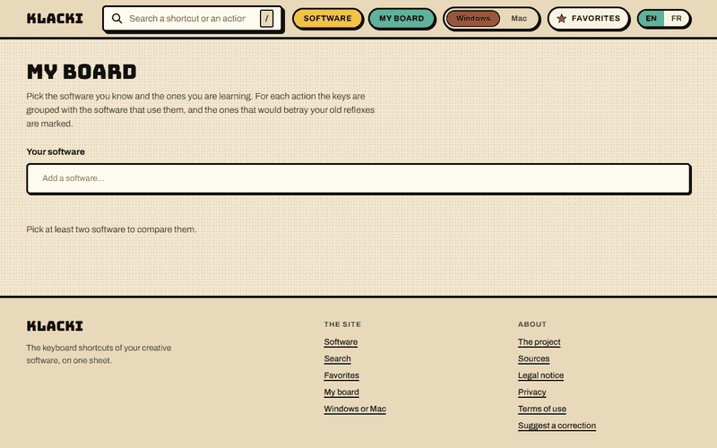
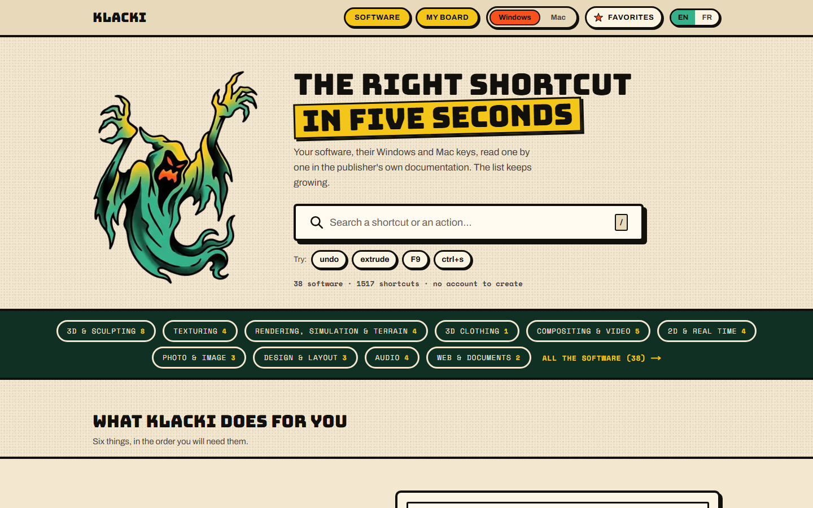
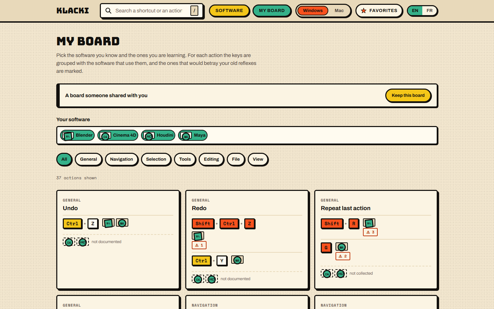
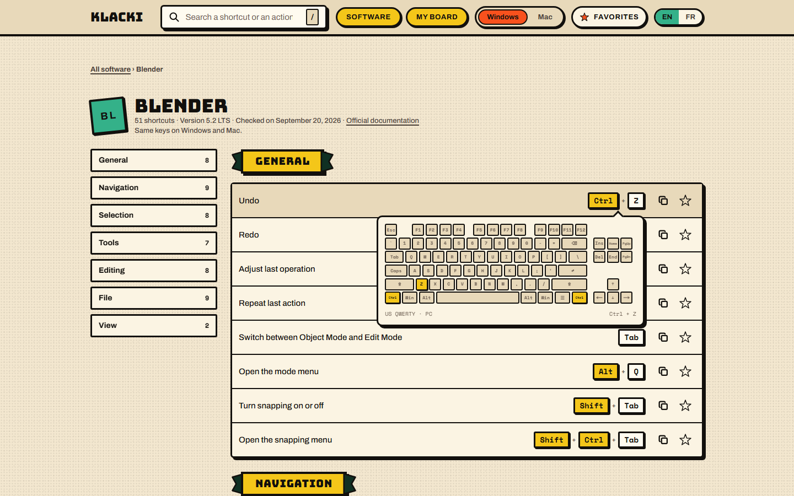
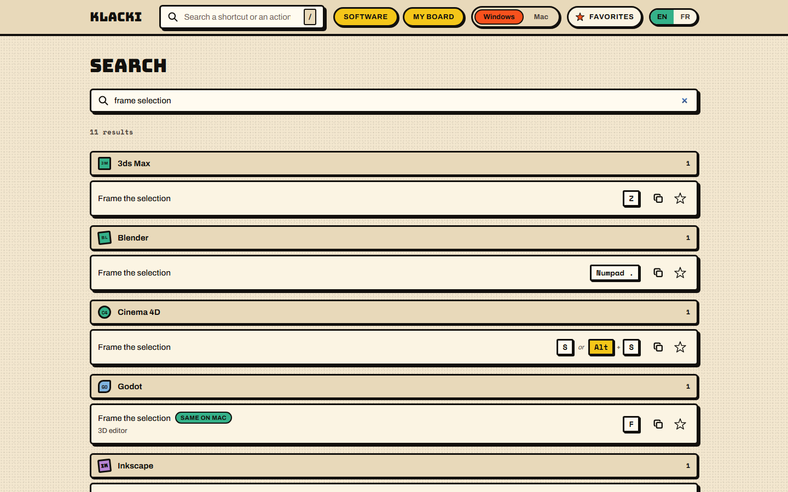
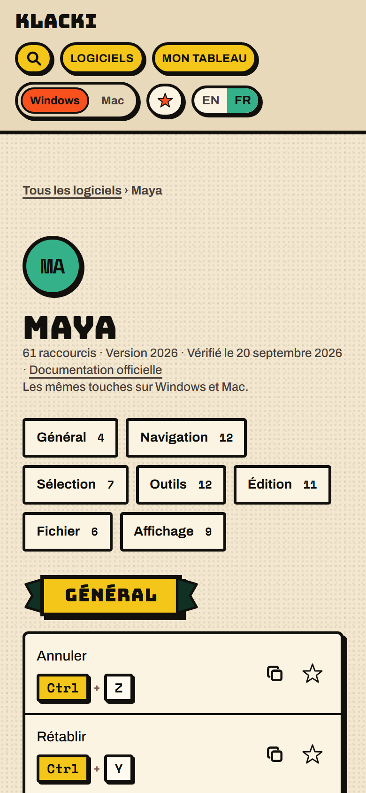
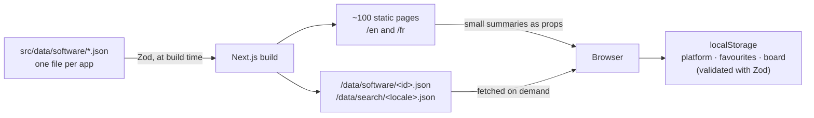

<div align="center">


# Klacki

**The keyboard shortcuts of 38 creative apps, checked one by one against the publisher's own documentation.**

3D, texturing, VFX, video, photo, design, audio. Windows and Mac. English and French.

[**Open the site →**](https://klacki.vercel.app)




</div>

| 38 apps | 1,517 shortcuts | 10 families | 2 languages × 2 platforms | 0 server, cookie or tracker |
| :-----: | :-------------: | :---------: | :-----------------------: | :-------------------------: |

## Contents

- [Why](#why)
- [Features](#features)
- [Architecture](#architecture)
- [Technical decisions](#technical-decisions)
- [Challenges](#challenges)
- [Quality](#quality)
- [Data sources](#data-sources)
- [About](#about)

## Why

Someone who works in Blender, ZBrush, Substance Painter and Nuke has four
different sets of reflexes, and the lists online don't help much:

- **They convert Ctrl to ⌘ blindly.** Blender keeps Ctrl on a Mac, Premiere
  switches to ⌘. A list that guesses is wrong one time in two.
- **They don't say where the keys come from**, or for which version.
- **They show one app at a time**, when the real question is "what does this
  key do in the _other_ app I use?"

Klacki answers with sourced data (version, check date and a link to the
official documentation on every page) and with tools built around using
several apps at once.

## Features



### My board: compare the apps you use

Tick the apps you know and the ones you are learning. Every action becomes a
card with one line per distinct key combination, the apps that share it
grouped together, and the **traps** flagged: the same keys doing something
else in another of your apps. A board can be shared by link (`?s=blender,maya`).



### Visual keyboard

Hover or tap the keys of any shortcut to see them lit on a keyboard, with
the numeric pad and the mouse only when the shortcut needs them. It is drawn
as a US QWERTY on purpose: that is the layout the documentation assumes, and
drawing the visitor's AZERTY would mean guessing again.



### Search by action or by key

`frame selection`, `undo`, `F9`, `ctrl+s`: one field searches the whole
catalogue, ignoring accents, case and word order, in both languages. Results
are grouped by app and paged 40 at a time.



### And the rest

- **Windows / Mac toggle**: one switch rewrites every key on the site.
- **Favourites** and **copy in one click** (`Blender · Undo — Ctrl + Z`).
- **Honest gaps**: when a publisher does not document an everyday action, the
  page says so. A key is never guessed to fill a hole.
- **A page on Windows vs Mac** that explains why Ctrl does not always become
  ⌘, and what changes on a non-US keyboard.
- **Built for phones** from 360 px up.

<p align="center">
  
</p>

## Architecture

No backend, no database, no API, no account. Everything is generated at
build time and served as files from Vercel's edge.



Each app is one JSON file, for example:

```json
{
  "id": "blender",
  "name": "Blender",
  "family": "3d-sculpt",
  "version": "5.2 LTS",
  "docUrl": "https://docs.blender.org/manual/en/latest/",
  "verifiedAt": "2026-09-20",
  "shortcuts": [
    {
      "id": "undo",
      "category": "general",
      "action": { "en": "Undo", "fr": "Annuler" },
      "keys": { "win": [["Ctrl", "Z"]], "mac": [["Ctrl", "Z"]] }
    }
  ]
}
```

```
src/data/software/*.json   the shortcuts, one file per app
src/domain/                the rules, in plain TypeScript, no React
src/app/[locale]/          the pages, one tree for /en and /fr
src/app/data/              route handlers that write the static data files
src/components/ui/         drawing only, no state
src/components/features/   client components that hold state
src/i18n/{en,fr}.json      every word a visitor reads
```

## Technical decisions

<details>
<summary><b>JSON in Git, not a database</b> — Versioned, reviewed and diffed like code; Zod stops the build on a bad file.</summary>

The data changes a few times a month and is written by hand from documentation, so it is versioned, reviewed and diffed like code, the way MDN's browser-compat-data is. A Zod schema checks every file at build time: a wrong or incomplete file stops the build instead of reaching a visitor. A database would only make sense with public contributions and accounts.

</details>

<details>
<summary><b>Keys stored per platform, never converted</b> — Blender keeps Ctrl on Mac, Premiere switches to ⌘: guessing is wrong half the time.</summary>

Each shortcut carries its own Windows and Mac keys. `isSameOnBothPlatforms` knows that Alt and Option are the same physical key, so the site can mark "same on Mac" honestly.

</details>

<details>
<summary><b>Built for a catalogue that grows</b> — One JSON file adds an app; pages fetch only what they show; 100 apps under 150 ms.</summary>

Adding an app means dropping one JSON file, and nothing in the code assumes a count. Pages never bundle the catalogue: they receive small summaries as props and fetch only the data they show. My board groups apps through a per-app combo index, and a benchmark keeps 100 apps under 150 ms.

</details>

<details>
<summary><b>Rules without React</b> — Search, board and keyboard logic are plain functions, tested without rendering.</summary>

Search, board cards and traps, platform differences and the keyboard layout live in `src/domain/` as plain functions. They are tested without rendering anything, and the components stay thin.

</details>

<details>
<summary><b>Browser state done right</b> — `useSyncExternalStore` plus Zod: no hydration mismatch, no trusted browser input.</summary>

Platform, favourites and board live in `localStorage`, read through `useSyncExternalStore` (no hydration mismatch, no `setState` in effects) and validated with Zod, since anything read back from the browser is untrusted input.

</details>

<details>
<summary><b>Type-safe translations</b> — A key missing in French is a TypeScript error, not a blank on the page.</summary>

The dictionary type comes from `en.json`, so a key missing in `fr.json` is a TypeScript error, not a blank on the page.

</details>

<details>
<summary><b>A design system, not a theme</b> — CSS custom properties and CSS Modules, self-hosted fonts.</summary>

Thick outlines, hard offset shadows, flat colours taken from the ghost. It is built on CSS custom properties and CSS Modules, with self-hosted fonts (Bungee, Archivo, Space Mono) through `next/font`. Each app gets a badge whose shape and type style come from a hash of its id, and whose colour comes from its family.

</details>

## Challenges

**Ctrl is not always ⌘.** Most shortcut sites store Windows keys and
convert them for Mac. The documentation shows why that fails: Blender keeps
Ctrl on a Mac, Premiere switches to ⌘, and Alt and Option are one key under
two names. So the data model stores both platforms explicitly from day one,
and the comparison that decides "same on Mac" treats Alt and Option as equal.

**My board had to survive a big catalogue.** The first version was a table
with one column per app: fine with 5 apps, unreadable with 14. It became one card per action with the apps grouped by key
combination, computed from a per-app combo index. A benchmark with 100 apps
keeps it under 150 ms.

**One JSON file per app, without shipping them all.** Once the catalogue
passed 1,000 shortcuts, importing it in client components would have put
every app in every page's bundle. The catalogue is now server-only; route
handlers write one static file per app and one search index per language at
build time, and the browser fetches only what a page shows, with a retry
when the network drops.

**A flaky dev server.** Under a burst of requests, a cold Next.js dev server
sometimes answered 500 ("Unexpected end of JSON input" in its manifest
loader). After confirming that production never does it, the end-to-end
suite warms every page before running instead of retrying tests blindly.

## Quality

- **Tests**: 116 unit tests (Vitest) on the domain rules and the data, and
  105 end-to-end tests (Playwright) covering search, board, favourites,
  keyboard, both languages, loading errors, and no sideways scroll at 360 px
  on every page. The suites are kept out of this public repository.
- **Lighthouse** (mobile, live site): Accessibility 100, SEO 100, Best
  practices 96, Performance 74 to 90 depending on the page.
- **Accessibility**: skip link, full keyboard use, visible focus, `aria-live`
  announcements for loading and results, `prefers-reduced-motion` respected.
- **Security**: OWASP review with nothing exploitable found, `npm audit`
  clean. Headers: Content-Security-Policy, HSTS (preload), X-Frame-Options
  `DENY`, `nosniff`, Referrer-Policy and Permissions-Policy. No user input
  ever reaches an HTML sink, and every URL parameter is checked against an
  allowlist.
- **Privacy**: no analytics, no cookies, no third-party requests. Terms of
  use and a GDPR-compliant privacy page, in both languages.
- **SEO**: canonical URLs, `hreflang` alternates, sitemap and Open Graph
  images, all generated.

## Data sources

Every shortcut is read in the publisher's official documentation for the
stated version. Keys are facts; every description is written for this site.
Each app page links to the page it was checked against, and the full list is
on the [sources page](https://klacki.vercel.app/sources).

## About

**Lucas Nevano**, developer

- Portfolio: _coming soon_
- LinkedIn: _coming soon_
